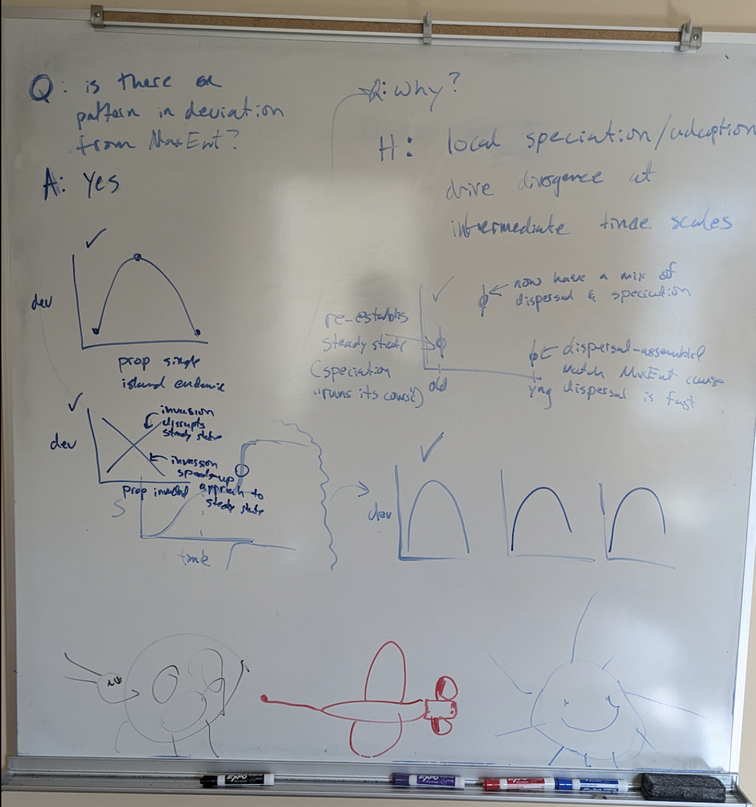

# Analysis plan

## Guiding questions

Is there a pattern in deviation from MaxEnt across the Hawaiian chronosequence? We know there is, so why does that pattern exist?

**Hypothesis:** Local speciation and adaptation drive divergence at intermediate time scales

## Planned visualizations

-   Deviation vs. ages of sites
-   Deviation vs. macro-states: Species, Individuals, Biomass
-   Deviation vs. proportion that are single island endemic
-   Deviation vs. proportion that are invasive
-   Comparing ecological similarity and deviation from MaxEnt between sites
-   Deviation in the number of rare species in data vs. MaxEnt compared across sites (age)

