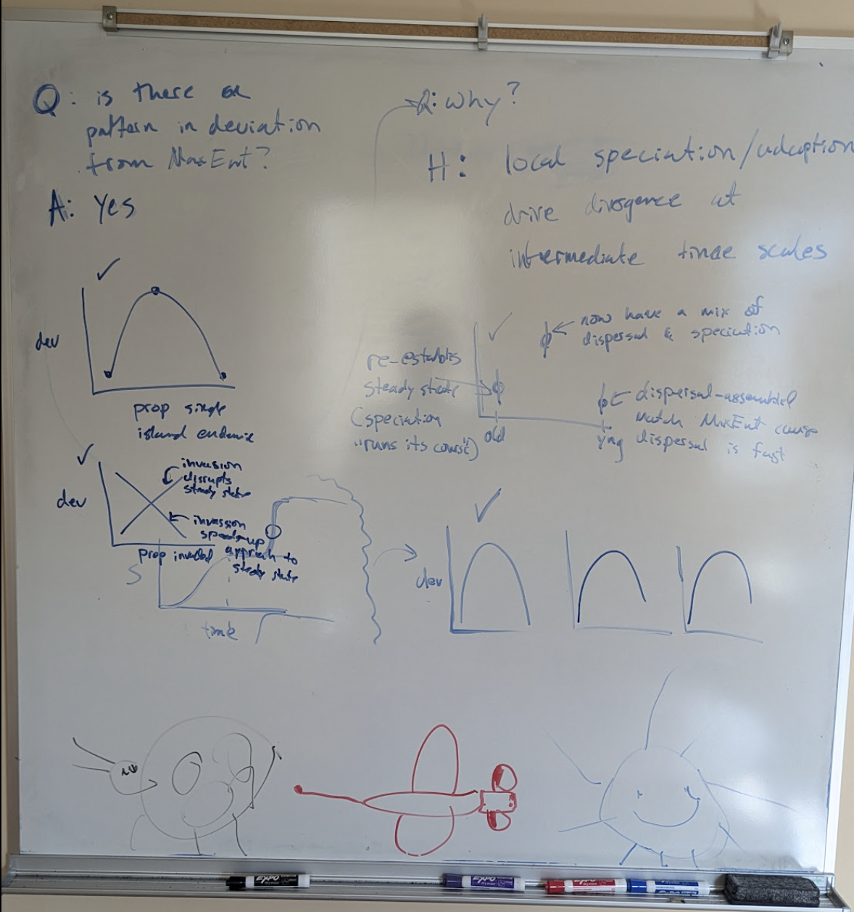

# Analysis plan

## Guiding questions

Is there a pattern in deviation from MaxEnt across the Hawaiian chronosequence? We know there is, so why does that pattern exist?

**Hypothesis:** Local speciation and adaptation drive divergence at intermediate time scales

## Planned visualizations

- Deviation vs. ages of sites
    - done
- Deviation vs. macro-states: Species, Individuals, Biomass
- Deviation vs. proportion that are single island endemic
    - turns out this is a challenge because of disproportionate sampling around Volcano
    - looks like big island has all the SIE taxa, but we know that isn't true
    - not continuing with this
- Deviation vs. proportion that are invasive
    - no pattern
    - done
- Comparing ecological similarity and deviation from MaxEnt between sites
    - more dissimilarity (compared to null) <==> more MaxEnt deviation
- Deviation in the number of rare species in data vs. MaxEnt compared across sites (age)

